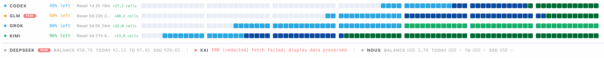

# hermes-subscription-meter

A subscription-quota dashboard plugin for [Hermes Agent](https://hermes-agent.nousresearch.com). This is not a progress bar: weekly quota is measured in time and split into **84 cells** (7 days × 12 cells a day), so how much you have used and how much is left is obvious at a glance, and the color shift tells you the current quota status. When choosing is hard, the plugin automatically ranks **the model it suggests you use first for the problem at hand** at the top.

**Provider visibility is controlled from the UI** — show or hide each provider yourself, no config-file edits.

## Screenshot



## Install

In the Hermes desktop app: **Settings → Plugins → Install from Git**, then enter:

```
NealZhouPanda/hermes-subscription-meter
```

Or from the CLI:

```bash
hermes plugins install NealZhouPanda/hermes-subscription-meter
```

The installer detects both components automatically: the agent-side backend (`plugin.yaml` + `__init__.py` + `backend/`) and the desktop-side panel (`plugin.js`). Restart the Hermes desktop app after installing.

## Supported providers

The discovery layer collects candidate credentials from the Hermes provider registry, the current profile's logged-in OAuth (auth.json) and configured environment slots, then picks a fetcher by rule:

| Provider | Source |
|---|---|
| Codex (ChatGPT) | Hermes `account_usage`, fallback to chatgpt.com usage endpoint |
| GLM (Zhipu) | open.bigmodel.cn quota endpoint |
| Kimi (Moonshot) | api.kimi.com coding usage endpoint |
| DeepSeek | api.deepseek.com balance + platform cost |
| xAI (Grok subscription) | Hermes `account_usage` (xai-oauth), fallback to CLI proxy billing |
| MiniMax | CN plan usage endpoint |
| Qwen (DashScope) | Alibaba Cloud balance API |
| Nous | Hermes `account_usage` |

Anything detected but lacking a fetcher is shown as `no_fetcher` rather than silently dropped. Quota windows and prepaid balances are both supported; unrecognized credentials are labeled instead of guessed at.

## How it works

- `plugin.js` — the desktop panel: the 84-cell matrix, balance bars, automatic ranking of the model it suggests you use first, and the per-provider visibility toggles (persisted per profile in plugin settings).
- `backend/plugin_api.py` — a FastAPI router that turns credentials into provider-neutral quota rows. Secrets stay in memory only; they never appear in API responses, logs or error strings.
- `tests/` — 84 frontend tests (node:test) + 110 backend tests (pytest).

## Development

Frontend tests (no dependencies, Node ≥ 18):

```bash
node --test tests/*.test.mjs
```

Backend tests (requires `fastapi`, `pydantic`; run from the repo root):

```bash
python -m pytest tests/
```

The backend test suite runs fully offline: every test gets a temp `HERMES_HOME` and outbound sockets are blocked by fixtures in `tests/conftest.py`.

`docs/dev/` contains the design-review notes from the provider-neutral refactor. `diagnostics/` holds small local debugging scripts used during development.

## Contact

Questions / issues / collaboration: nealzhou.panda@gmail.com

## License

[MIT](LICENSE) © 2026 Neal Zhou

A Chinese README (`README.zh-CN.md`) may be added later.
